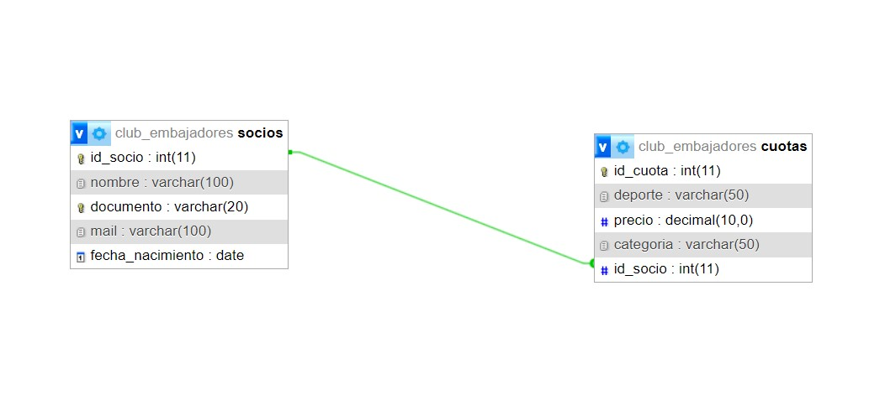

# Proyecto CLUB_EMBAJADORES

Este proyecto forma parte del curso Web 2 y tiene como objetivo gestionar los datos de los socios de un club y sus respectivas cuotas, utilizando una base de datos relacional en MYSQL.

## Estructura de la Base de Datos

La base de datos del club, llamada **CLUB_EMBAJADORES**, está compuesta por dos tablas principales:

1. **SOCIOS**: Almacena la información de los miembros del club.
2. **CUOTAS**: Registra los pagos de las cuotas correspondientes a cada socio, clasificadas por deporte y categoría.

## Relación entre Tablas

Las tablas están relacionadas mediante el campo **ID_SOCIO**, lo que crea una relación de 1 a N entre **SOCIOS** y **CUOTAS**. A continuación, se muestra el diagrama que ilustra esta relación:

## Scripts de SQL

- **Creación de tablas**: Se definen las tablas **SOCIOS** y **CUOTAS**, con claves primarias y foráneas.
- **Relaciones**: La clave foránea conecta **ID_SOCIO** en **CUOTAS** con **ID_SOCIO** en **SOCIOS**, permitiendo una relación de 1 socio a múltiples cuotas.
- **Inserción de datos**: Se incluye un volcado de datos de ejemplo en ambas tablas.
